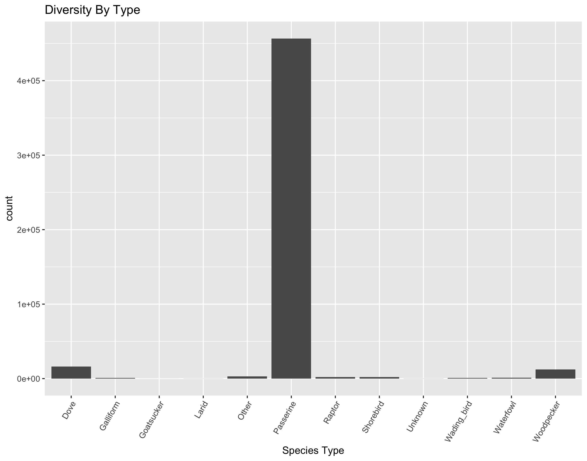

```{r setup, include=FALSE}
knitr::opts_chunk$set(echo = TRUE)
```

```{r, include = FALSE}
library(stringr)
library(ggplot2)
library(lubridate)
library(tidyverse)
library(modelr)
library(plotly)
```

```{r, include = FALSE}
df <- read.csv("./Raw_Data/Data/2ndPA_BirdAtlas_bird_counts.csv")
df_point <- read.csv("./Raw_Data/Data/2ndPA_BirdAtlas_pointcount_location_and_conditions.csv")
df_adj200 <- read.csv("./Raw_Data/Data/adjusted_200m_allvars.csv")
df_adj1 <- read.csv("./Raw_Data/Data/adjusted_1km_allvars.csv")
df_adj2 <- read.csv("./Raw_Data/Data/adjusted_2km_allvars.csv")
df_adj4 <- read.csv("./Raw_Data/Data/adjusted_4km_allvars.csv")
df_adj6 <- read.csv("./Raw_Data/Data/adjusted_6km_allvars.csv")
df_adj8 <- read.csv("./Raw_Data/Data/adjusted_8km_allvars.csv") 
df_adj10 <- read.csv("./Raw_Data/Data/adjusted_10km_allvars.csv")
df_adj12 <- read.csv("./Raw_Data/Data/adjusted_12km_allvars.csv")
df_adj16 <- read.csv("./Raw_Data/Data/adjusted_16km_allvars.csv")
df_adj500 <- read.csv("./Raw_Data/Data/adjusted_500m_allvars.csv")

```

There are three types of data sets in this project:
+ Bird count data
+ Point data for each location
+ Distance adjusted values


```{r, include=FALSE}
str(df)
str(df_point)
str(df_adj200)
str(df_adj1)
```

Here are the current categories in the three data set types.

Bird count data: 

| Column ID | Description |
| --------- | ----------- |
| BBA_ID | Unique data collection point |
| SP_code | Four-letter species code |
| X1.75 | Counts of song within 75 meters, trial 1 |
| X1.75.1 | Counts of song outside 75 meters, trial 1 |
| X2.75 | Counts of song within 75 meters, trial 2 |
| X2.75.1 | Counts of song outside 75 meters, trial 2 |
| X3.75 | Counts of song within 75 meters, trial 3 |
| X3.75.1 | Counts of song outside 75 meters, trial 3 |
| X4.75 | Counts of song within 75 meters, trial 4 |
| X4.75.1 | Counts of song outside 75 meters, trial 4 |
| X5.75 | Counts of song within 75 meters, trial 5 |
| X5.75.1 | Counts of song outside 75 meters, trial 5 |
| Non.songCue.75 | Counts of signs other than song inside 75 meters |
| Non.songCue.75.1 | Counts of signs other than song outside 75 meters |
| Fly.Over | Counts of birds that flew over the collection point |

Point Data: 

| Column ID | Description |
| --------- | ----------- |
| BBA_ID | Unique data collection point |
| GPS_N | Northing in decimal degrees |
| GPS_W | Easting in decimal degrees |
| Observer | four letter observer code |
| obscode | Observer number |
| Date | Date of collection |
| Start | Start time |
| Temp | Temperature at time of collection |
| Q1 | Wind speed factor |
| Q2 | Precipitation factor |
| Q3 | Cloud cover factor |
| Q4 | Rank of hemlock abundance |
| Q5 | Rank of hemlock health |
| Q6 | Rank of spruce abundance |
| Q7 | Spruce qualifier |
| Q8 | Extent of forest understory |
| Q9 | Degree of deer browse impact on the understory |
| Q10 | Evidence of active land use change |
| Q11 | Pastured livestock or barn present? |
| Q12 | Rank of natural nesting cavity presence |
| Q13 | Rank of nest box presence |
| Q14 | Road type |
| Q15 | Dominant habitat within 75 meters |

Distance adjusted data: 
+ Note: there are a few differences between each distance adjusted file

| Column ID | Description |
| --------- | ----------- |
| X (not always present) | Not sure what this means |
| LID | Point count location ID |
| TYPE40 | Proportion of landscape composed of All Forest | 
| PD40 | Patchiness of All Forest |
| CL40 | Clumpiness of All Forest |
| TYPE41 | Proportion of landscape composed of Deciduous Forest |
| PD41 | Patchiness of Deciduous Forest |
| CL41 | Clumpiness of Deciduous Forest |
| TYPE42 | Proportion of landscape composed of Evergreen Forest |
| PD42 | Patchiness of Evergreen Forest |
| CL42 | Clumpiness of Evergreen Forest |
| TYPE43 | Proportion of landscape composed of Mixed Forest |
| PD43 | Patchiness of Mixed Forest |
| CL43 | Clumpiness of Mixed Forest |
| TYPE80 | Proportion of landscape composed of Agricultural Land |
| obscode | Point count observer code |
| Dia | Julian date of point count |
| Ano | Year of point count |
| Start | Time point count began |
| LULC | Observer classification of land cover change at point count location |
| habitat | Observer classification of dominant habitat type at point count location |
| MQCOMP1 | First component of a PCA including the four Developed land cover classes, area-weighted average population density, and area-weighted average housing density |
| MQCOMP2 | First component of a PCA including the four Developed land cover classes, area-weighted average population density, and area-weighted average housing density |
| SHDI | Shannon Diversity Index of land cover classes |
| ELEV_MEAN | Mean elevation in landscape |
| ELEV_RANGE | Difference between highest and lowest elevation in landscape |
___

##### Troubleshooting

Since we need to combine these data sets, we need to know if they have the same values for at least one column. The only one that is in all the sets that is unique to the data entry is the ID code for the point
+ If the point codes do not match each other, we cannot combine them easily.
+ Easiest way: look for any that do not match when comparing values (logical operators)

```{r}
sum(!(df_adj200$LID %in% df$BBA_ID))
sum(!(df$BBA_ID %in% df_adj200$LID))

sum(!(df_adj1$LID %in% df$BBA_ID))
sum(!(df$BBA_ID %in% df_adj1))

sum(!(df$BBA_ID %in% df_point$BBA_ID))
sum(!(df_point$BBA_ID %in% df$BBA_ID))
```

When comparing between the bird count data and the distance adjusted data for two distance data sets, there were differences between IDs. However, there were no entry differences when comparing the bird count and point data.

It is possible that the distance adjusted IDs only cover a few of the points, so it might help to join the adjusted distance data sets together.
+ Still want to keep the distance adjustment though (units in km)

```{r}
df_adj1$dist <- 1
df_adj2$dist <- 2
df_adj4$dist <- 4
df_adj6$dist <- 6
df_adj8$dist <- 8
df_adj10$dist <- 10
df_adj12$dist <- 12
df_adj16$dist <- 16
df_adj200$dist <- 0.2
df_adj500$dist <- 0.5
```

Since some datasets have different columns, we will combine the ones with the same columns, then fix the difference

```{r}
adj <- bind_rows(df_adj1, df_adj2, df_adj4, df_adj6, df_adj8, df_adj10, df_adj12, df_adj16)
adj2 <- bind_rows(df_adj200, df_adj500)
adj <- adj[, -1]
adj2 <- adj2[,-22]
```

Now, binding and comparing the adjusted sets:

```{r}
adj_fin <- bind_rows(adj, adj2)
adj_fin$dist <- as.factor(adj_fin$dist)
sum(!(adj_fin$LID %in% df$BBA_ID))
sum(!(df$BBA_ID %in% adj_fin$LID))
```

There are still a lot of IDs that are not consistent; we will omit the adjusted data to retain most of the count and point information and to simplify things.

___

##### Cleaning the Data

```{r, include = FALSE}
df$Non.songCue.75.1 <- as.integer(as.character(df$Non.songCue.75.1))
```

Since the counts do no good when determining the total counts at a certain time, we will add all the values from the count columns and place them into one column.

```{r}
df$TotalCounts <- rowSums(df[, -c(1, 2)], na.rm = TRUE)
```


```{r, include = FALSE}
df_adj <- adj_fin
```

Now, we need to rename the columns Q1 - Q15 so they make sense. Afterward, we will make the names easier to work with.

```{r}
names(df_point) <- c("BBA_ID" , "GPS_N", "GPS_W", "Observer", "obscode", "Date", "Start", "Temp","wind_speed", "precip", "cloud_cover", "hemlock_abundance", "hemlock_health", "spruce_abundance", "spruce_qual", "understory", "deer_impact_understory", "land_use", "livestock", "nest_cav", "nest_box", "road_type", "habitat") 
names(df) <- str_replace(names(df), pattern = "\\.", replacement = "_")
names(df) <- str_replace(names(df), pattern = "X", replacement = "Trial")
names(df) <- str_replace(names(df), pattern = "75.1", replacement = "out")
names(df) <- str_replace(names(df), pattern = "75", replacement = "in")
```

Now we need to join the point data and the bird count data with *full_join()* and tidy the data set.
+ Because of length, this will not be included in the visible code.

___
```{r, include = FALSE}
df <- full_join(df, df_point, by="BBA_ID")
df$In75m <- rowSums(df[, c(3,5,7,9,11,13,15)], na.rm = TRUE)
df$Out75m <- rowSums(df[, c(4,6,8,10,12,14)], na.rm=TRUE)
df2 <- df[, -c(3:15)]
df2 <- df2[, c(1,2,26,27,3:25)]
df2 <- gather(df2, key="range_val", value = "count", 3:5)
df2 <- df2[, c(1,2, 25, 26, 3:24) ]
df <- df[, c(1:15, 39, 40, 16:38)]
df2 <- df[!df$SP_code == "#N/A",]
df3 <- df2[!df2$Date == "" ,]
df4 <- df3
df4 <- df4[, c(1,2,16:40)]
df4_cc <- df4[complete.cases(df4),]
df4_cc$Date <- as.Date(df4_cc$Date, format = "%m/%d/%y")
df4_cc$Start <- str_pad(df4_cc$Start, 4, pad=0)
df4_cc$POSIX <- as.POSIXct(paste(df4_cc$Date, df4_cc$Start), format="%Y-%m-%d %H%M")
df4_cc <- df4_cc[c(1:11, 28, 12:27)]
count1 <- df4_cc
count1$Start <- as.integer(count1$Start)
count1$number <- 1:nrow(count1)
count1$month <- month(count1$Date)
count1$month <- month.abb[count1$month]
count1$month <- as.factor(count1$month)
```

Here is a list of the changes made to the data:
+ Joined bird count and point data
+ Added month and POSIX column for different date and time options
+ Changed the format of the Date column
+ Condensed the tallies for bird counts into "In75m, "Out75m", and "TotalCounts", with the total counts column being "In" and "Out" added
+ Got rid of NA values

Since there will be some variation between different kinds of birds, and since it is hard to put all the different species code in a facet-wrapped chart (among other things), I decided to add a species type column, using the species code and grouping them by similarity. 

*Note: the dataframe name changed from df to count1 in the cleaning process. Sorry if this causes any inconvenience*

```{r}
count1duck <- count1[count1$SP_code %in% c("ABDU", "AMCO", "AMWI", "BUFF", "BWTE", "CAGO", "CANV", "COLO", "COME", "GADW", "GWTE", "HOME", "LESC", "MALL", "MUSW", "NOPI", "PBGR", "RBME", "RNDU", "RUDU", "TRUS", "WODU"),]
count1wade <- count1[count1$SP_code %in% c("AMBI", "BCNH", "BEKI", "CAEG", "COMO", "GBHE", "GLIB", "GREG", "GRHE", "KIRA", "LEBI", "SACR", "SNEG", "SORA", "VIRA", "WISN", "YCNH", "YEAR"),]
count1pass <- count1[count1$SP_code %in% c("ACFL", "ALFL", "AMCR", "AMGO", "AMRE", "AMRO", "BANS", "BAOR", "BARS", "BAWW", "BBCU", "BCCH", "BGGN", "BHCO", "BHVI", "BLBW", "BLGR", "BLJA", "BLPW", "BOBO", "BRCR", "BRTH", "BRWA", "BTBW", "BTNW", "BWWA", "CACH", "CARW", "CAWA", "CCSP", "CEDW", "CERW", "CHSP", "CLSW", "COGR", "CORA", "COYE", "CSWA", "DEJU", "DICK", "EABL", "EAKI", "EAME", "EAPH", "EATO", "EAWP", "EUST", "FICR", "FISP", "GCFL", "GCKI", "GRCA", "GRSP", "GWWA", "HESP",  "HETH", "HOFI", "HOLA", "HOSP", "HOWA", "HOWR", "INBU", "KEWA", "LASP", "LAWA", "LEFL", "LOSH", "LOWA", "MAWA", "MAWR", "MOWA", "NAWA", "NOBO", "NOCA", "NOMO", "NOPA", "NOWA", "NRWS", "OROR", "OSFL", "OVEN", "PISI", "PIWA", "PRAW", "PROW", "PUFI", "PUMA", "RBGR", "RBNU", "RCKI", "RECR", "REVI", "RWBL", "SAVS", "SCTA", "SEWR", "SOSP", "SUTA", "SWSP", "SWTH", "SWWA", "TRES", "TUTI", "VEER", "VESP", "WAVI", "WBNU", "WEME", "WEVI", "WEWA", "WIFL", "WIWR", "WOTH", "WTSP", "WWCR", "YBCH", "YBCU", "YBFL", "YRWA", "YTVI", "YTWA", "YWAR"),]  
count1rapt <- count1[count1$SP_code %in% c("AMKE", "BADO", "BAEA", "BANO", "BLVU", "BWHA", "CLSW", "COHA", "EASO", "GHOW", "LEOW", "MERL", "NOGO", "NOHA", "NSWO", "OSPR", "PEFA", "RSHA", "RTHA", "SEOW", "SSHA", "TUVU"),]
count1shor <- count1[count1$SP_code %in% c("AMWO", "KILL", "SPSA", "UPSA"),]
count1tern <- count1[count1$SP_code %in% c("BLTE", "BOGU", "CATE", "COTE", "DCCO", "FOTE", "GBBG", "HEGU", "LAGU", "LBBG", "LETE", "RBGU", "RHWO"),]
count1game <- count1[count1$SP_code %in% c("CHUK", "RNPH", "RUGR", "WITU"),]
count1goat <- count1[count1$SP_code %in% c("CONI", "CWWI", "WPWI"),]
count1peck <- count1[count1$SP_code %in% c("DOWO", "HAWO", "NOFL", "PIWO", "RBWO", "YBSA"),]
count1dove <- count1[count1$SP_code %in% c("EUCD", "MODO", "ROPI"),]
count1other <- count1[count1$SP_code %in% c("CHSW", "RTHU"),]
count1unk <- count1[count1$SP_code %in% c("XXXX", "ZZZZ"),]
```

When doing this, I noticed that there were about 3000 rows of data missing, so I investigated a little... turns out there were some species codes that were not in the key, which is a problem. I promptly looked up the four-letter species codes for these species and added them into their respective categories, then redid the assigning.

*note: Some species names were listed as two different forms of species codes, so I had to change them to the entry that was on the key.*

```{r}
count1$SP_code <- as.character(count1$SP_code)
count1$SP_code[count1$SP_code == "RODO"] <- "ROPI"
count1$SP_code[count1$SP_code == "TRFL"] <- "WIFL"
count1$SP_code[count1$SP_code == "BDOW"] <- "BADO"
count1$SP_code[count1$SP_code == "ESOW"] <- "EASO"
count1$SP_code[count1$SP_code == "ECDO"] <- "EUCD"
count1$SP_code <- as.factor(count1$SP_code)
count1duck <- count1[count1$SP_code %in% c("SNGO","ABDU", "AMCO", "AMWI", "BUFF", "BWTE", "CAGO", "CANV", "COLO", "COME", "GADW", "GWTE", "HOME", "LESC", "MALL", "MUSW", "NOPI", "PBGR", "RBME", "RNDU", "RUDU", "TRUS", "WODU"),]
count1wade <- count1[count1$SP_code %in% c("AMBI", "BCNH", "BEKI", "CAEG", "COMO", "GBHE", "GLIB", "GREG", "GRHE", "KIRA", "LEBI", "SACR", "SNEG", "SORA", "VIRA", "WISN", "YCNH", "YEAR"),]
count1pass <- count1[count1$SP_code %in% c("CMWA", "WCSP", "HYCH", "ACFL", "ALFL", "AMCR", "AMGO", "AMRE", "AMRO", "BANS", "BAOR", "BARS", "BAWW", "BBCU", "BCCH", "BGGN", "BHCO", "BHVI", "BLBW", "BLGR", "BLJA", "BLPW", "BOBO", "BRCR", "BRTH", "BRWA", "BTBW", "BTNW", "BWWA", "CACH", "CARW", "CAWA", "CCSP", "CEDW", "CERW", "CHSP", "CLSW", "COGR", "CORA", "COYE", "CSWA", "DEJU", "DICK", "EABL", "EAKI", "EAME", "EAPH", "EATO", "EAWP", "EUST", "FICR", "FISP", "GCFL", "GCKI", "GRCA", "GRSP", "GWWA", "HESP",  "HETH", "HOFI", "HOLA", "HOSP", "HOWA", "HOWR", "INBU", "KEWA", "LASP", "LAWA", "LEFL", "LOSH", "LOWA", "MAWA", "MAWR", "MOWA", "NAWA", "NOBO", "NOCA", "NOMO", "NOPA", "NOWA", "NRWS", "OROR", "OSFL", "OVEN", "PISI", "PIWA", "PRAW", "PROW", "PUFI", "PUMA", "RBGR", "RBNU", "RCKI", "RECR", "REVI", "RWBL", "SAVS", "SCTA", "SEWR", "SOSP", "SUTA", "SWSP", "SWTH", "SWWA", "TRES", "TUTI", "VEER", "VESP", "WAVI", "WBNU", "WEME", "WEVI", "WEWA", "WIFL", "WIWR", "WOTH", "WTSP", "WWCR", "YBCH", "YBCU", "YBFL", "YRWA", "YTVI", "YTWA", "YWAR"),]  
count1rapt <- count1[count1$SP_code %in% c("AMKE", "BADO", "BAEA", "BANO", "BLVU", "BWHA", "CLSW", "COHA", "EASO", "GHOW", "LEOW", "MERL", "NOGO", "NOHA", "NSWO", "OSPR", "PEFA", "RSHA", "RTHA", "SEOW", "SSHA", "TUVU"),]
count1shor <- count1[count1$SP_code %in% c("SBDO","LEYE", "AMWO", "KILL", "SPSA", "UPSA"),]
count1tern <- count1[count1$SP_code %in% c("BLTE", "BOGU", "CATE", "COTE", "DCCO", "FOTE", "GBBG", "HEGU", "LAGU", "LBBG", "LETE", "RBGU", "RHWO"),]
count1game <- count1[count1$SP_code %in% c("CHUK", "RNPH", "RUGR", "WITU"),]
count1goat <- count1[count1$SP_code %in% c("CONI", "CWWI", "WPWI"),]
count1peck <- count1[count1$SP_code %in% c("DOWO", "HAWO", "NOFL", "PIWO", "RBWO", "YBSA"),]
count1dove <- count1[count1$SP_code %in% c("EUCD", "MODO", "ROPI"),]
count1other <- count1[count1$SP_code %in% c("CHSW", "RTHU"),]
count1unk <- count1[count1$SP_code %in% c("XXXX", "MUSC", "ZZZZ"),]
```

Now I will add species type and join the datasets back together.

```{r}
count1duck$species_type <- "Waterfowl"
count1wade$species_type <- "Wading_bird"
count1pass$species_type <- "Passerine"
count1rapt$species_type <- "Raptor"
count1shor$species_type <- "Shorebird"
count1tern$species_type <- "Larid"
count1game$species_type <- "Galliform"
count1goat$species_type <- "Goatsucker"
count1peck$species_type <- "Woodpecker"
count1dove$species_type <- "Dove"
count1other$species_type <- "Other"
count1unk$species_type <- "Unknown"
count2 <- rbind(count1dove, count1duck, count1game, count1goat, count1other, count1pass, count1peck, count1rapt, count1shor, count1tern, count1unk, count1wade)
```

I somehow ended up with duplicate entries... I will need to fix that.

Process: 
+ find duplicated entries
+ omit doubles

```{r}
count2 <- count2[!(duplicated(count2$number)),]
```


```{r, include = FALSE}
count3 <- count2[!count2$cloud_cover == 2.5 ,]
count3 <- count3[!count3$wind_speed == 2.5 ,]
count3 <- count3[!count3$spruce_abundance == 0.5 ,]
count3 <- count3[!count3$spruce_abundance == 1.5 ,]
count3 <- count3[!count3$spruce_qual == 0.5 ,]
count3 <- count3[!count3$spruce_qual == 1.5 ,]
count3 <- count3[!count3$understory == 2.5 ,]
count3 <- count3[!count3$road_type == 2.5 ,]
count3$wind_speed <-  as.factor(count3$wind_speed)
count3$precip <- as.factor(count3$precip)
count3$cloud_cover <- as.factor(count3$cloud_cover)
count3$hemlock_abundance <- as.factor(count3$hemlock_abundance)
count3$hemlock_health <- as.factor(count3$hemlock_health)
count3$spruce_abundance <- as.factor(count3$spruce_abundance)
count3$spruce_qual <- as.factor(count3$spruce_qual)
count3$understory <- as.factor(count3$understory)
count3$deer_impact_understory <- as.factor(count3$deer_impact_understory)
count3$land_use <- as.factor(count3$land_use)
count3$livestock <- as.factor(count3$livestock)
count3$nest_cav <- as.factor(count3$nest_cav)
count3$nest_box <- as.factor(count3$nest_box)
count3$road_type <- as.factor(count3$road_type)
count3$habitat <- as.factor(count3$habitat)
```
___

#####Exploring and Modeling the Data
I am going to reload the data set from a saved file; the name will be df again.

```{r, include = FALSE}
df <- count3
```

Now, we can answer some questions about the data.
The first question: How many entries were there for each bird (or bird type)?
```{r, echo = FALSE}
ggplotly(ggplot(df, aes(x=SP_code, y= TotalCounts))+
           geom_bar(stat = "identity")+
           theme(axis.text.x = element_text(angle = 60, hjust = 1))+
           labs(title = "Diversity By Species", x = "Species Code"))
```



For the species diversity plot, the top entries (above 10000 observations) belong to the passerine species type except for the mourning dove entry (MODO). For the type chart, the passerine type has an overwhelming majority of observations.

The top three species observed in each area were 
+ Song Sparrow (SOSP)
+ Red-eyed Vireo (REVI)
+ American Robin (AMRO)

This does not account for total counts within an area. Let's look at the most abundant species overall: 

```{r, include = FALSE}
df5 <- df %>%
  select(SP_code, species_type, TotalCounts)%>%
   group_by(SP_code)%>%
  mutate(TotalCounts = sum(TotalCounts))
dfTotal <- unique(df5)
```

```{r, echo = FALSE}
ggplotly(ggplot(dfTotal, aes(x=SP_code, y=TotalCounts))+
           geom_bar(stat = "identity")+
           theme(axis.text.x = element_text(angle = 60, hjust = 1)))
```


The top three species are still the same, in order, and there is still an overwhelming majority of passerine species. The main difference is the number of observations.

What is the trend for birds seen dependent on time?
```{r, include = FALSE}
df2 <- df
df2$Start <-  str_pad(df2$Start, 4, pad = "0")
df2$Start <- as.POSIXct(df2$Start, format = "%H%M")
dfTime <- df2%>%
  select(Start, month, POSIX, Temp, TotalCounts)%>%
  group_by(Start)%>%
  mutate(TotalCounts = sum(TotalCounts))
dfTime <- unique(dfTime)
```

```{r, echo = FALSE}
ggplotly(ggplot(dfTime, aes(x=Start, y=TotalCounts))+
           geom_point()+
           labs(title = "Observations Over Time", x="Start Time (AM)", y="Bird Counts"))
```

We can see that there is an upward trend in observations from about 4:50 am to 5:45 (the graph is interactive, so tags show for each time), then a steady decrease until about 9:40, when it sharply declines.

*Note: I had to change the date to the same date in order for this to work, and I just used the due date. This does NOT tell which month it is in.*

Here is the graph faceted by month: 


The trend is approximately the same for each month.

I am curious how much the temperature changes the appearance of birds.


Since the most noticeable change in temperature only occurs in may, it is possible that the temperature only has marginal effect on the appearance of birds during the day.

Which species happened to have the highest count during a single data collection time?


Most of the categories have counts under 50 per collection point, but there is a point in the waterfowl category that is over 100... 

```{r}
mystery <- df[df$TotalCounts == max(df$TotalCounts),]
mystery[1, "SP_code"]
```
The mystery bird with over 100 counts is a mallard (MALL species code), which is interesting considering that the most abundant species are songbirds.

I am wondering what the distribution of temperature is overall, and for each month...


somehow that second graph had an almost normal distribution... not sure why that works.


It is interesting that the temperatures on the last distribution were almost normal for their individual months as well.

Is there a difference in counts by month?


It looks like there is more activity south in May, then a slight migration pattern through July, when there are more observations in the north than the south. 

___

Now for modeling... 

Using all the variables in a model crashed, so it isn't included in this project.

Let's try a model with most (but not all) of the factors and see how that works, then add predictions and plot.

```{r}
mod1 <- aov(data = df, TotalCounts~ month+Temp+wind_speed+precip+cloud_cover+hemlock_abundance+hemlock_health+spruce_abundance+spruce_qual+understory+deer_impact_understory+land_use+livestock+nest_cav+nest_box+road_type+habitat)
dfPred <- add_predictions(df, model = mod1)
```


That plot wasn't the best. Let's try another model, with just one variable to see how that works

```{r}
mod2 <- lm(data = df, TotalCounts ~ Temp)
dfPred <- add_predictions(dfPred, model = mod2, var = "pred2")
```


That was worse. Good to know.

Next!

```{r}
mod3 <- aov(data = df, TotalCounts~Temp * species_type)
summary(mod3)
```
This summary shows that all the factors are significant, which should be good...

```{r}
dfPred <- add_predictions(dfPred, model = mod3, var = "pred3")
```


That's a little better than the previous model, but not by much.

Let's try another one and see if it is any better, this one by temperature, type, and habitat: 
```{r}
mod4 <- aov(data = df, TotalCounts ~ Temp+species_type+habitat)
summary(mod4)
```
This says all the factors are significant, so that should mean something, but I don't think it will change anything.


That's marginally better...

For one last try, I will try several of the factors that would likely influence the outcome the most (maybe), we will see if it works. If not, I will move to modeling something else.
```{r}
mod5 <- aov(data = df, TotalCounts~Temp+month+Start+species_type+habitat+GPS_N+GPS_W)
```


That isn't super great either. It is possible that this particular set is too random to predict.

Maybe if the subsetted data from the time curve is used (with species type totals instead of observation ID totals), then we can determine some factors; there seems to be a strong correlation between counts and time of day.
```{r}
mod6 <- aov(dfTime, formula = TotalCounts ~Start)
```


Trying to train and test the model now, since it works better than the other ones...

```{r, include = FALSE}
library(caret)
```

```{r}
trainingsamples <- createDataPartition(dfTime$TotalCounts,p=0.5,list=FALSE)
train <- dfTime[trainingsamples,]
test <- dfTime[-trainingsamples,]
mod7 <- aov(data = train,TotalCounts~Start)
dftest <- add_predictions(test,mod7)
```


It still doesn't quite follow the trend of data, but it follows the same general line as the previous model.

